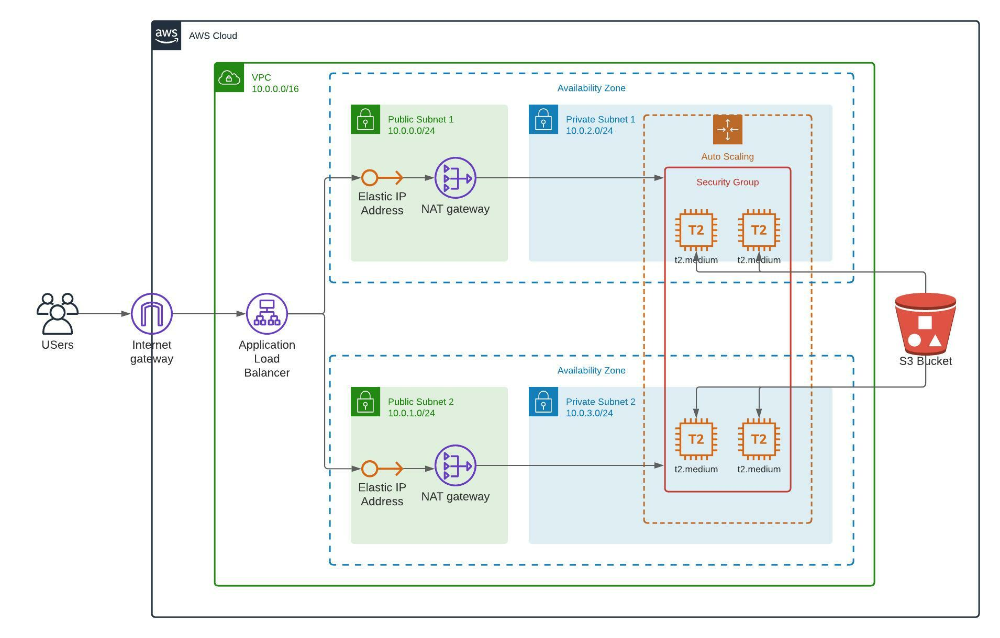

# Deploy a high availability web app using cloudformation

## Project overview

in this project we will deploy a web application using cloudformation with the same inframation as the following diagram

#### Find me in social media

